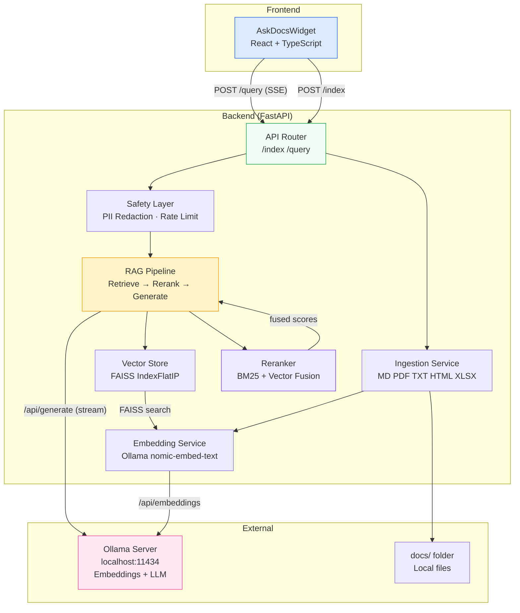

# Ask-Docs (Local-LLM) — Embeddable AI Plugin

A production-lean AI plugin that performs Retrieval-Augmented Generation (RAG) against a local `docs/` folder. It returns grounded answers with citations and streams responses to a React widget. **All LLM inference runs locally — no cloud APIs.**

## Architecture



## Prerequisites

| Tool | Version | Purpose |
|------|---------|---------|
| Python | 3.10+ | Backend |
| Node.js | 18+ | Frontend |
| Ollama | latest | Embeddings (`nomic-embed-text`) + LLM (`mistral`) |
| ~8–16 GB RAM | — | For 7B model inference |

## Quick Start

```bash
make run       # Install deps, pull Ollama models, start backend (:8000) + frontend (:3000)
```

### Individual Commands

```bash
make setup     # Install all dependencies + pull Ollama models
make backend   # Start backend only
make frontend  # Start frontend only
make index     # Index the docs/ folder (auto-starts Ollama & backend if needed)
make sample    # Index + run a sample query
make test      # Run all tests
```

Then open **http://localhost:3000** to use the widget.

## Project Structure

```
├── backend/
│   ├── app/
│   │   ├── main.py              # FastAPI app + middleware
│   │   ├── config.py            # Settings (env + defaults)
│   │   ├── models.py            # Pydantic schemas
│   │   ├── routers/api.py       # /index and /query endpoints
│   │   ├── services/
│   │   │   ├── ingestion.py     # File discovery, parsing, chunking
│   │   │   ├── vector_store.py  # FAISS index + Ollama embeddings
│   │   │   ├── reranker.py      # BM25 + vector score fusion
│   │   │   └── rag.py           # RAG pipeline + LLM generation
│   │   └── utils/
│   │       ├── logger.py        # Structured JSON logging
│   │       ├── safety.py        # PII redaction, profanity filter
│   │       └── rate_limit.py    # Per-IP rate limiter
│   ├── tests/                   # Unit + integration tests
│   └── pyproject.toml
├── frontend/
│   ├── src/
│   │   ├── components/
│   │   │   ├── AskDocsWidget.tsx
│   │   │   └── CitationCard.tsx
│   │   ├── hooks/useAskDocs.ts
│   │   ├── types/index.ts
│   │   └── styles/widget.css
│   ├── package.json
│   └── vite.config.ts
├── docs/                        # Sample documents (5 files)
├── scripts/
│   ├── run_sample.sh            # Index + query one-liner
│   └── setup_model.sh           # Pull Ollama models
├── deploy/helm/ask-docs/        # Helm chart skeleton
├── Makefile
└── README.md
```

## Configuration

All settings are configurable via environment variables or a `.env` file in `backend/`:

| Variable | Default | Description |
|----------|---------|-------------|
| `OLLAMA_BASE_URL` | `http://localhost:11434` | Ollama API URL |
| `LLM_MODEL` | `mistral` | Ollama model for generation |
| `LLM_TEMPERATURE` | `0.1` | Generation temperature |
| `LLM_MAX_TOKENS` | `1024` | Max tokens to generate |
| `EMBEDDING_MODEL` | `nomic-embed-text` | Embedding model name |
| `CHUNK_SIZE` | `512` | Chunk size in characters |
| `CHUNK_OVERLAP` | `64` | Overlap between chunks |
| `TOP_K` | `5` | Default retrieval count |
| `SIMILARITY_THRESHOLD` | `0.35` | Abstention threshold |
| `RERANK_ENABLED` | `true` | Enable BM25 + vector reranking |
| `RERANK_VECTOR_WEIGHT` | `0.4` | Reranker vector similarity weight |
| `RERANK_BM25_WEIGHT` | `0.6` | Reranker BM25 keyword weight |
| `MAX_FILE_SIZE_MB` | `50` | Max file size for ingestion |
| `RATE_LIMIT_PER_MINUTE` | `30` | Per-IP rate limit |

## Tests

```bash
make test
```

- **Unit tests**: Chunking, text cleaning, ignore rules, PII redaction, input validation
- **Integration test**: `/query` endpoint — verifies SSE streaming, citation format, abstention

## License

MIT

## Demo Screenshot


